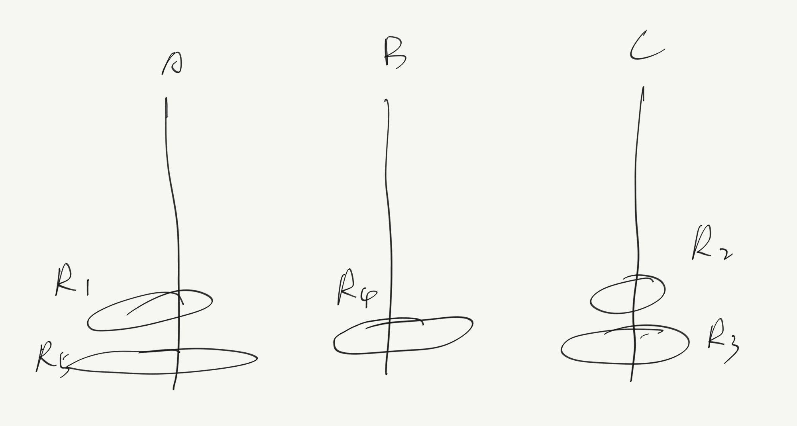

## HW2

1. *Consider a Tower of Hanoi with Disordered Start problem with 5 rings. Recall that Ring i has radius i. We write Ri to refer to Ring i. Suppose that initially R5 and R1 are on Pole A,R4 isonPoleB,andR3 andR2 areonPoleC. Whatisthefirstmoveifthegoalisto move all the rings to Pole B (using the algorithm given in the lecture notes). Justify your answer briefly.*

   

   Analysis: 
   
   >If our goal is to move all the rings to Pole B, we have to move $R_5$ to the Pole B.
   >
   >The general rule is to move all the rings into one Pole and then it becomes the original version of the Tower of Hanoi problem. 
   >
   >To do that, we have the following steps:
   >
   >1. Move $R_1$ to Pole C
   >2. Move $R_4$ to Pole A
   >3. Move all the rings on Pole C to Pole A
   >
   >Then we can start to move all the rings from Pole A to Pole B
   
   **Ans:** **The first move is to move $R_1$ to Pole C**

2. *Consider the Max Tower of Hanoi problem. The input is a 3 pole Tower of Hanoi problem with n rings on pole A initially. The task is to give a recursive algorithm that causes the rings to go through each possible configuration exactly once, ending with all n rings on pole C.*

   **Ans:**

   ```pseudocode
   MaxToH(n,A,B,C)
   	if n = 1 then do 
   		Move Rn from A to C
   	end(*if do*)
   	else do 
   		MaxToH(n-1, A,C,B)
   		MaxToH(n-1, B,A,C)
   		Move Rn from A to B
   		MaxToH(n-1, C,A,B)
   		MaxToH(n-1, B,C,A)
   		Move Rn from B to C
   		MaxToH(n-1, A,C,B)
   		MaxToH(n-1, B,A,C)
   	end("else do")
   end(*MaxToH*)
   ```

3. *Let T be a tree. Compute the total edge length of all root to leaf paths. Hint. What information do you need to compute at each node v?*

   Analysis:

   >To compute the length of the path, we have to know the total edge length of each node v and depth from the root.
   >
   >Assume storing the result for node v in v.tlp (total edge length), so as other nodes. 
   >
   >The initial call will be to TLP(v, 1). 

   ```pseudocode
   TLP(v,depth)
   	v.tlp <- 0, 
   	for each child w of v do
   		if w has child then do
   			TLP(v,depth+1)
   		else
   			v.tlp <- v.tlp+depth
   	end(*for*)
   end(*TLP*)
   ```

4. *Suppose you are given a tree T in which each node is colored blue or red. A path is all-blue if all its vertices are blue. For each node v, determine the edge-length of the longest all-blue path contained in the subtree rooted at v, storing the result in v.allb; note that the longest all-blue path does not have to include vertex v. v’s color is stored in the field v.clr. Hint. You will need to use an additional field which you need to specify. What is the answer if v.clr = Red? What answers are possible if v.clr = Blue?*

   Analysis

   >v.lpd stands for the longest all-blue path descending from v.
   >
   >When iterating the child of the node v, when need to ensure what color the node v is. 
   >
   >1. If v.clr=Red, we don't need to consider the path passing through node v, so we can just continue calling LBP on its child and compare the stored results in v.allb with its child, i.e. w.allb.
   >2. If v.clr=Blue, we have to consider the path passing through node v, so other than comparing v.allb and w.allb, we should add this path constructed by the longest all-blue path descending from v before plus 1 plus the longest all-blue path descending from its child w.

   ```pseudocode
   LBP(v)
   	v.allb<-0,v.lpd<-0
     for each child w of v do
     	LBP(w);
       if v.clr = Red then do
         v.allb<-max{v.allb,w.allb};
       end(*if do*)
       else do
       	if w.clr=Blue do
           v.allb<-max{v.allb,v.lpd+1+w.lpd, w.allb};
           v.lpd<-max{v.lpd,1+w.lpd};
         end(*if do*)
       end{*else do*}
     end{*for*}
   end{*LBP*}
   ```
   
   