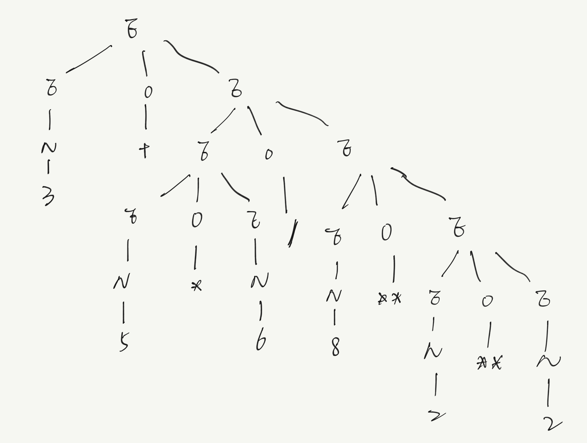

## Solution

### Problem 1: Regular Expressions (12 Points)

1. Identifiers in C.

   **Ans:**

   ```
   [a-zA-Z_][a-zA-Z0-9_]*
   ```

2. US phone numbers. 

   **Ans:**

   ```
   (\([2-9][0-9]{2}\)|[2-9][0-9]{2})(-[2-9][0-9]{2}-[0-9]{4}|\.[2-9][0-9]{2}\.[0-9]{4})
   ```

3. String literals in Java.

   **Shorthand definitions:**

   ```
   exceptCharacter ::= (\\u00(0[0-9A-Ea-e]|f[0-9A-Ea-e]|[1-9A-Ea-e][0-9A-Fa-f])|\\u0[1-9A-Fa-f][0-9A-Fa-f]{2}|\\u[1-9A-Fa-f][0-9A-Fa-f]{3})
   otherCharacter ::= [^\,",\\,\n,\r]
   ```
   
   **Ans:**
   
   ```
   "(\\[btfnr"'\\]|exceptCharacter|\\[0-3]?[0-7]{1,2}|otherCharacter)*"
   Or runnable version:
   "(\\[btfnr"'\\]|(\\u00(0[0-9A-Ea-e]|f[0-9A-Ea-e]|[1-9A-Ea-e][0-9A-Fa-f])|\\u0[1-9A-Fa-f][0-9A-Fa-f]{2}|\\u[1-9A-Fa-f][0-9A-Fa-f]{3})|\\[0-3]?[0-7]{1,2}|[^\"\\\n\r])*"
   ```

### Problem 2: Context-Free Grammars

1. Productions:

   ```
    S ::= MB 
    M ::= S | ε
    A ::= bAA | aC
    B ::= bC | aBB
    C ::= bA | aB | ε
   ```

   A. Mathematical notation:

   $$
   \begin{align*}
   &S::= SB|B\\
   &B::=aBB|baB|bC|b\\
   &C::= \epsilon|aB|bA\\
   &A::=bAA|aC\\
   \rightarrow L(G)&::= B^+\\
   B&::=aBB|baB|bbA|b\\
   A&::= bAA|aaB|a|abA
   \end{align*}
   $$


   >First, L(G) is generated by $B^+$, as B at least occurs once. 
   >
   >1. If B goes to a, then non-terminal symbol B will be generated twice
   >2. If B goes to b, then three options will be given:
   >    1. Quit
   >    2. Generate terminal symbol a with non-terminal symbol B again, i.e., go back to step 2.
   >    3. Generate terminal symbol b with non-terminal symbol A, i.e., go to step 3 or 4.
   >3. If A goes to b, then the non-terminal symbol A will be generated twice, i.e., go step 3 or 4 twice. 
   >4. If A goes to a, go back to step 2.

   B. Parse Tree

   

2. Parse tree

   

